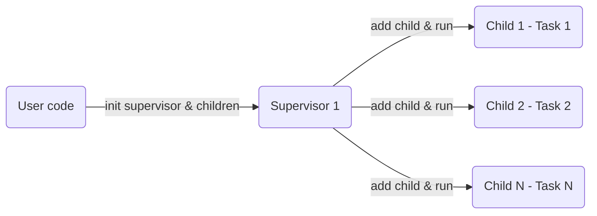

[](https://pkg.go.dev/github.com/manhvu/easyworker)

# Introduce

A Golang package for supporting worker supervisor model.
The package help developer easy to run parallel tasks.
It's scalable with minimum effort.

easyworker package is inspired by Erlang OTP.

# Design

The package has two main part:

* The supervisor: Manage children, give a task to children & collect result.
* The children: Receive tasks, run tasks then send results to supervisor.

## Supervisor

Start workers and monitor workers.
Send task to workers and get result(for task & stream).
Restart children if they're failed (depends restart strategy).
Supervisor has one goroutine for send & manage signal to children.

## Child

Run task with user's function and handle error.
If user's function panic worker will check retry config and re-run (depend restart strategy/retry times) if needed.
Each child has a goroutine to run its task.

# Guide

easyworker support 3 type of workers:

* Supervisor, Start a supervisor for managing custom workers. Workers can run many type of tasks.
* Task, Add a list of task and run workers. Workers run same type of task.
* Stream, Start workers then push tasks to workers from channel. Workers run same type of task.

Package use standard log package, if you want log to file please set output for log package.

(*required Go 1.19 or later.*)

## Install

Add package to go.mod

```bash
go get github.com/manhvu/easyworker
```

Import package

```go
import "github.com/manhvu/easyworker"
```

## Use Cases

### Supervisor

This is used for generic worker(child).
Every children has a owner restart strategy.

Currently, child has three type of restart strategy:

* ALWAYS_RESTART, supervisor always restart children if it panic/done.
* ERROR_RESTART, supervisor will restart if children was panic.
* NO_RESTART, supervisor will don't restart children for any reason.

Children will be started after they are added to supervisor.

In restart case, children will re-use last parameters (if task don't change it) of task.

Supervisor -> Child -> call user functions

Basic supervisor's flow:


(install extension support mermaid to view flow)

supervisor example:

```go
// example function need to run in child.
loop := func(a int) {
	for i := 0; i < a; i++ {
		time.Sleep(time.Second)
		fmt.Println("loop at", i)
	}
	fmt.Println("Loop exit...")
}

// example function run in child. It will panic if counter > 3.
LoopWithPanic := func(a int, panicString string) {
	for i := 0; i < a; i++ {
		time.Sleep(time.Second)
		fmt.Println("loop at", i)
		if i > 3 {
			panic(panicString)
		}
	}
    // maybe you won't see this.
	fmt.Println("LoopWithPanic exit...")
}

// create a supervisor.
sup := easyworker.NewSupervisor()

// add direct child to supervisor.
sup.NewChild(easyworker.ERROR_RESTART, Loop, 5)
sup.NewChild(easyworker.NO_RESTART, LoopWithPanic, 5, "test panic")


// create a child.
child, _ := easyworker.NewChild(easyworker.ALWAYS_RESTART, LoopWithPanic, 5, "other panic")

// add exists child.
sup.AddChild(&child)

//...

// stop all worker.
// this function depends how long fun return.
sup.Stop()
```

Supervisor support context by create supervisor by function `NewSupervisorWithContext`.
In case supervisor with context, the first parameter of user function will be context.
Context will include supervisor's id and child's id.

User code can get with key:

* CTX_SUP_ID for supervisor's id
* CTX_CHILD_ID for child's id

Call `GetSupervisor` to get supervisor from supervisor's id.

To get child please call `GetChild` method of supervisor.

Example:

```go
// basic func with context.
loopWithContext := func(ctx context.Context, a int) {
	// get supervisor's id.
	supId := ctx.Value(easyworker.CTX_SUP_ID)
	// get child's id.
	childId := ctx.Value(easyworker.CTX_CHILD_ID)

	for i := 0; i < a; i++ {
		fmt.Println("Sup: ", supId, "Child:", childId, "counter:", i)
		time.Sleep(time.Millisecond)
	}
}

// create supervisor with context.
sup := NewSupervisorWithContext(context.Background())

// add child.
sup.NewChild(easyworker.NO_RESTART, loopWithContext, 10)
```

For other APIs please go to [pkg.go](https://pkg.go.dev/github.com/manhvu/easyworker)

### EasyTask

This is simple way to run parallel tasks.
User doesn't need to manage goroutine, channel, ...
Number of workers is number of goroutine will run tasks.

In retry case, worker will re-use last parameters of task.

EasyTask example:

```go
// simple task.
func sum(a ...int) (ret int) {
	for _, i := range a {
		ret += i
	}
	return ret
}

func parallelTasks() {
	// number of workers.
	numWorkers := 3

	// retry times.
	retryTimes := 0

	// sleep time before re-run.
	retrySleep := 0

	// new config for EasyTask.
	config, _ := easyworker.NewConfig(sum, numWorkers, retryTimes, retrySleep)

	// new EasyTask.
	task, _ := easyworker.NewTask(config)

	// add tasks.
	myTask.AddTask(1, 2, 3)
	myTask.AddTask(3, 4, 5, 6, 7)
	myTask.AddTask(11, 22)

	// start workers.
	r, e := myTask.Run()

	if e != nil {
		t.Error("run task failed, ", e)
	} else {
		fmt.Println("task result:", r)
	}
}
```

### EasyStream

This type is used for streaming type.
In this case, tasks are continuously send to worker by user's channel.
Results will receive from other channle of user.
Number of workers is number of goroutines used for processing streaming task.

In retry case, workers will re-use last parameters of task.

EasyStream example:

```go
// fun will do task
fnStr = func(a int, suffix string) string {
	if a%3 == 0 {
		panic("panic from user func")
	}
	return fmt.Sprintf("%d_%s", a, suffix)
}

// input channel.
inCh := make(chan []any)

// result channel.
outCh := make(chan any)

// number of workers = number of cpu cores (logical cores).
config, _ := easyworker.NewConfig(fnStr, easyworker.DefaultNumWorker(), 3, 1000)

// test with stream.
myStream, _ := easyworker.NewStream(config, inCh, outCh)

// start stream.
myStream.Run()

// receive data from stream.
go func() {
    for {
        r := <-outCh
        fmt.Println("stream result: ", r)
    }
}()

// send data to stream.
go func() {
    for i := 0; i < 15; i++ {
        input := []any{i, "hello"}
        inCh <- input
        fmt.Println("stream sent: ", input)
    }
}()


//...

// stop all worker.
myStream.Stop()
```

### Monitor Go

A wrapper for go routine for easy monitor when goroutine was panic or run task done.

`Monitor` function will return two params.
First param is unique reference id.
Second param is channel that user can receive signal.

Signal is a struct with reference id and kind of end (failed, done).

Example:

```go
// create go task.
g,_ := easyworker.NewGo(loopRun2, 5)

go func() {
	// get a monitor to g.
	refId, ch := g.Monitor()

	// get a signal when g done/failed.
	sig := <-ch

	fmt.Println("ref:", refId, "ok")
}()

// start Go task.
g.Run()
```